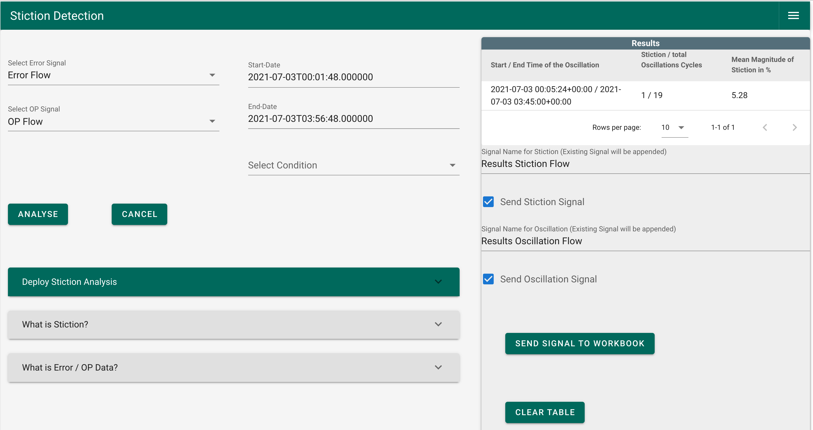

# User Guide

----

## Overview

This section explains the workflow and the algorithm of the seeq-stictiondetection add-on. It also includes important technical terms and the physical background will be explained.

## What is Valve Stiction and why should it be detected?

Every plant in the process industry requires the ability to control important variables such as temperatures and flows during production to ensure a safe manufacturing process. Actuators are field instruments that act on the process. Valves are a type of an actuator that can increase or decrease the amount of liquids and gases, for example to cool a reactor or even the particle flow inside a pipe. Valves directly intervene in the process. With the nearly infinite possible use cases in the process industry valves are one of the most common control apparatus. A good operation of the valves is therefore of utmost importance. To ensure an unobstructed manufacturing process it is of importance to monitor the performance of the valves. One possible way is to investigate the data received from the process monitoring system and try to find characteristic patterns inside the data. Here, we first explain the basics of automation and control loops to undstand what data is available and how it can help monitor control valves. 

## Control Theory

In this section will be explaining the basics of control by understanding a simple feedback control loop. For instance, a control loop could be a temperature sensor and a valve as the actuator. The process variable (PV) is compared to the desired setpoint (SP). The controller acts on the descrepancy or error between the PV and the SP, giving a signal (OP) to the actuator, i.e. the valve. The valve output is is a flow which acts on the process. In theory, the valve does exactly what the controller tells it to do but reality often is far from it. It is important to note that in the process industry the three variables SP, PV and OP are recorded for each control loop. The single input single output control loop is illustrated in the following figure. The manipulated variable (MV) is usually not recorded and therefore not accessible for analysis. 

##### Figure 1: Feedback loop

An indication of a problem with the valve is valve stiction. Stiction causees an oscillation in the process variable (PV) and the controller output (OP) as the valve stem does not directly transforms the controller output to the manipulated variable. To distinguish between oscillations caused by stiction and oscillations caused by other problems in the control loop, such as tight tuning settings, one needs to look at the shape of the oscillations. Purely sinusoidal oscillations will result in a perfect ellipsoid shape when plotting the PV against the OP. Oscillations caused by valve stiction will have sharp edges in the corners of the PV-OP plot. Because the setpoint (SP) can vary and thus distort the shape of the PV-OP plot it is advisable to use the error signal instead of the PV. The error is computed from subtracting the PV from the SP. In short, here oscillations are identified, the error-OP plot is scanned for sharp edges.  

# Stiction Detection Algorithm

As explained in the above section, the detection algorithm should first detect oscillations and in case the oscillations are sharp cornered in the Error-OP plot the valve shows stiction with a high probability. The algorithm for the oscillation detection examined and counts the zero crossings. Additionally, the approach evaluates if the amplitude of one cycle (data between two zero crossings) is above a user defined percentage and this cycle will be counted. If the number of counted cycles exceeds the predefined number within the supervision time then this time period contains an oscillating signal. The algorithm was taken to determine the start and end point of the oscillation and then to slice the raw signal. The sliced signal will then further be sliced containing one full oscillation cycle. This data will be plotted in a scatterplot and an image will be created out of that. The following figure can be taken as an example on how the images could look like. 

##### Figure 2: Sharp cornered ellipse and smooth cornered ellipse

A shape detection algorithm is applied to ensure that the investigated images contain an elliptical shape. For that the OpenCV library is utilized by first finding the contours and then comparing the ellipse with three different ellipses. In case the similarity with one of the compared ellipses is higher than 50 % the analysis will be continued. In the next step the two edges of the ellipse will be cropped and stored as separated images. This step is followed by closing and detecting the contour of the shapes. The images could now look like the ones illustrated in the following figure. 

##### Figure 3: Sharp cornered ellipse compared to smooth cornered ellipse detail

To find the minimum number of points the Ramer–Douglas–Peucker Algorithm is applied. By connecting those points with straight lines the shape will represent the original shape sufficiently. If the shape could be presented by three points it shows a triangle which means that it is a sharp cornered ellipse and therefore and clear evidence of stiction in the valve. The result of the analysis is then a signal which contains the amount of stiction in percent. In addition, the user could send the oscillating signal back to the Workbench. The oscillating signal equals one if an oscillation is present and zero if no oscillation is detected. The user could now apply a “Value Search” to find the time intervals where signal is oscillating or is above a certain amount of stiction. The magnitude of the stiction will be calculated by fitting an ellipse in the sharp cornered ellipse. Then the width of the fitted ellipse will be calculated which represents the amount of stiction in the control valve. 

# How to Use

The workflow can be divided into eight steps. In the following section those steps explained in more detail. The workflow in short is given below. A more detailed explanation can be found **here (Master Thesis Link)**. 

##### Figure 4: Stiction Detection UI

### Workflow

1)	Select error and OP signal
2)	Review if the selected time range is sufficient (the default is the display range)
3)	Select a condition if needed (Selection of the wrong Condition could be changed by clicking on the “CANCEL” button)
4)	Click on the “ANALYSE” button (wait until the loader in the button disappears)
5)	In case something interesting was found it will be displayed in the “Results” section
6)	Give the signals names and check the box which should be sent to the workbench
7)	Click on “SEND SIGNAL TO WORKBOOK” button 
8)	Use “Deploy Stiction Analysis” to schedule the stiction analysis (coming soon)

# Example Use Cases 

## First Use Case: Oscillation Detection 

The first step when detecting stiction in control valves is to identify oscillatory behaviour in the OP signal. The following figure shows a signal (green) with three separated areas of oscillations. The other signal (purple) is the result from the oscillation detection. From this short example can be derived that the algorithm is able to detect oscillations and locate the start and end points. 

##### Figure 5: Oscillating signal and results from the Oscillation Finder

Choosing a more detailed view the green signal shows a clear suffering from oscillation behaviour. 

##### Figure 6: Detail view of the oscillation signal

## Second Use case: Stiction Contained Signal (Level)

The first example containing information of stiction is taken from the SACAC Database and contains information about a level loop. A detailed look at the signal shows clear sign of stiction. Those signs are illustrated in the following figure. A first indicator is that the signal is oscillating. The second indicator is the flat corners of the oscillation. Those flat corners lead in the Error OP plot to sharp cornered ellipses. 

##### Figure 7: Detailed time trend of the level signal

The results of the can be seen in the following figure. In this figure is the Error signal (orange), the OP signal (purple), the stiction signal (blue) and the results of the oscillation finder (green). From the analysis can be seen that there the algorithm detected it as a stiction case with a magnitude of 2 %. 

##### Figure 8: Results of the stiction analysis 

## Third Use Case Stiction Contained Signal (Flow)

The third use case is a flow loop suffering from stiction. A slice of the signal can be investigated in the following figure. The flat cornered peaks of the oscillation are clear signs of a loop suffering from stiction. 

##### Figure 9: Detailed time trend of the flow signal

The results generated by the Stiction Detection add-on can be reviewed in the following figure. The add-on can detect the oscillation and the signs of stiction in the signals. In this figure is the Error signal (purple), the OP signal (blue), the stiction signal (orange) and the results of the oscillation finder (green) The calculated magnitude of stiction is 5 %.

##### Figure 10: Results flow loop
