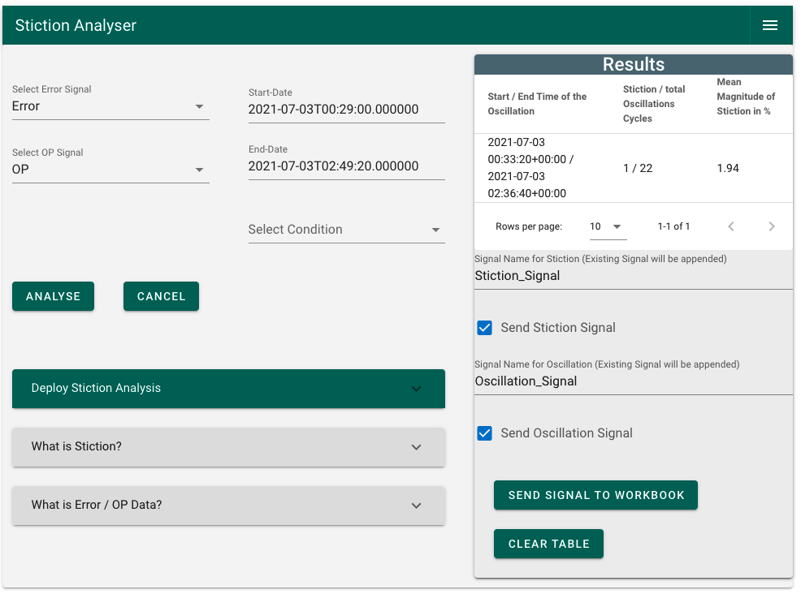

 


----
**seeq-stictionanalyser** is a Python module to detect oscillations and stiction patterns in control valves. It is intended to be used as an Add-on in Seeq Workbench. The oscillation analyzer, which is part of this Add-on, detects and isolates periods of time during which oscillations occur. The stiction analyzer identifies if stiction is present during the oscillating time periods identified by the oscillation analyzer. An oscillation index and/or a stiction index can be pushed back into the Seeq Workbench as time series signals for monitoring and additional analysis (e.g. with the "Value Search" function in Seeq). The module includes a user interface (UI) designed to interact with the Seeq server.

----

# Quick Demo

A quick video demonstation of the Add-on is available below:
 
<video src="https://user-images.githubusercontent.com/75427181/137947372-30305201-ec9d-49a9-a0bd-4f7eb6a4fed0.mov"
  poster="/DocumentationImages/StictionAnalyzer_Poster.PNG"
  controls="controls" muted="muted" class="d-block rounded-bottom-2 width-fit" style="max-width:700px;
   ) ">
</video>
----

# User Guide

[**seeq-stictionanalyser User Guide**](https://haw-process-automation.github.io/Stiction-Analyser/user-guide)
provides a more in-depth explanation of the algorithm behind the stiction analysis and how seeq-stictiondetection works. Examples of typical types
of analyses using **seeq-stictionanalyser** can be found in the User Guide.

----
# Installation

**seeq-stictionanalyser** requires **Python 3.7** or later.

## Dependencies

See [`requirements.txt`](/requirements.txt) file for a list of
dependencies and versions. Additionally, you will need to install the `seeq` module with the appropriate version that
matches your Seeq server. For more information on the `seeq` module see [seeq at pypi](https://pypi.org/project/stictionanalyser/)

## User Installation Requirements (Seeq Data Lab)

If you want to install **seeq-stictionanalyser** as a Seeq Add-on Tool, you will need:

- Seeq Data Lab (>= R50.5.0, >=R51.1.0, or >=R52.1.0)
- `seeq` module whose version matches the Seeq server version
- Seeq administrator access
- Enable Add-on Tools in the Seeq server

## User Installation (Seeq Data Lab)

The latest build of the project can be found in [pypi.org](https://pypi.org/project/stictionanalyser/) as a wheel file. The file is published as a
courtesy to the user, and it does not imply any obligation for support from the publisher. 

1. Create a new Seeq Data Lab project and open the Terminal window
2. Run pip install stictionanalyser
3. Run `python -m seeq.addons.stictionanalyser [--users <users_list> --groups <groups_list>]` 


----


# Development

We welcome new contributors of all experience levels. The **Development Guide** has detailed information about
contributing code, documentation, tests, etc.

## Important links

* Official source code repo: https://github.com/HAW-Process-Automation/Stiction-Analyser/
* Issue tracker: https://github.com/HAW-Process-Automation/Stiction-Analyser/issues

## Source code

You can get started by cloning the repository with the command:

```shell
git clone git@github.com:seeq12/seeq-stictiondetection.git
```

## Installation from source

For development work, it is highly recommended creating a python virtual environment and install the package in that
working environment. If you are not familiar with python virtual environments, you can take a
look [here](https://docs.python.org/3.8/tutorial/venv.html)

Once your virtual environment is activated, you can install **seeq-stictionanalyser** from source with:

```shell
python setup.py install
```

## Testing

There are several types of testing available for **seeq-stictionanalyser**

### Automatic Testing

After installation, you can launch the test suite from the root directory of the project (i.e. `seeq-stictionanalyser `
directory). You will need to have pytest >= 5.0.1 installed

To run all tests:

```shell
pytest
```

*Note:* Remember that the `seeq` module version in your local environment should match the Seeq server version

### User Interface Testing

To test the UI, use the `developer_notebook.ipynb` in the `development` folder of the project. This notebook can also be
used while debugging from your IDE. You can also create a whl first, install it on your virtual environment, and then
run `developer_notebook.ipynb` notebook there.


----


Maintainer: Timothy Essinger


----

# Citation

Please cite this work as:

```shell
seeq-stictionanalyser v0.0.1
HAW Process Automation
https://github.com/HAW-Process-Automation/Stiction-Analyser
```
